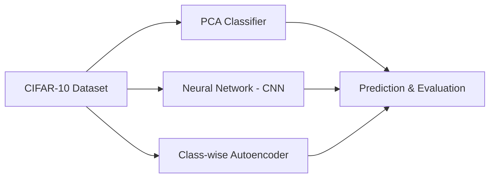

<div align="center">

  # 🚀 CIFAR-10 Image Classification Project


</div>

## 🧾 Overview

This project explores three machine learning approaches for **CIFAR-10 image classification**:

- 🎯 **PCA-based Classifier**
- 🧠 **Convolutional Neural Network (CNN)**
- 🔍 **Class-wise Autoencoders**

The goal is to compare performance across methods and analyze their effectiveness on this challenging dataset.

## 📽️ Demo

<video width="640" height="360" controls>
  <source src="video.mp4" type="video/mp4">
  Your browser does not support the video tag.
</video>

## 📁 Dataset

We use the **CIFAR-10** dataset:
- 60,000 32x32 color images
- 10 distinct classes (airplane, car, bird, cat, deer, dog, frog, horse, ship, truck)
- Split: 50,000 train / 10,000 test

📦 **Note**: Dataset not included in this repository due to size limits (>100MB). It will be auto-downloaded using `torchvision.datasets`.


## 🧠 Model Architecture Flow




## 📊 Results Summary

| 🔬 Technique             | 🎯 Best Accuracy |
|--------------------------|------------------|
| PCA Classifier           | 38.73%           |
| Convolutional Neural Net | 70.98%           |
| Class-wise Autoencoder   | 43.69%           |

✅ **Best Performer**: **CNN with 70.98% accuracy**


## 🔧 Implementation Breakdown

### 1️⃣ PCA Classifier
- Separate PCA models per class  
- Images reconstructed using class-specific PCA  
- Class with **lowest reconstruction error** is predicted  
- **Best hyperparameter**: `k = 40` components


### 2️⃣ Convolutional Neural Network (PyTorch)

```python
# Architecture
Conv2d(3, 32) → ReLU → MaxPool
→ Conv2d(32, 64) → ReLU → MaxPool
→ Flatten → Linear(1600, 128) → ReLU
→ Linear(128, 10)
```

- Optimizer: **Adam**  
- **Best Params**: Learning Rate = `0.0005`, Batch Size = `128`  
- Trained for **20 epochs**


### 3️⃣ Class-wise Autoencoder
- A separate autoencoder is trained for **each class**  
- During inference, compute reconstruction error from each model  
- Predict label based on **minimum reconstruction error**  
- **Best Encoding Dimension**: `128`


## ⚙️ Setup & Usage

### 🔨 Install Dependencies
```bash
pip install torch torchvision numpy matplotlib
```

### 🚀 Run the Project
```bash
git clone https://github.com/yourusername/cifar10-classification.git
cd cifar10-classification

python main.py
```

---

## 📂 Project Structure
```bash
cifar10-classification/
├── data/                  # CIFAR-10 dataset (auto-downloaded)
├── task1_pca/             # PCA classification
├── task2_nn/              # CNN implementation
├── task3_autoencoder/     # Class-wise autoencoders
├── utils/                 # Utility scripts
├── main.py                # Master runner script
└── README.md              # This file
```

---

## 🔍 Key Observations

- 📈 **CNN dominates** with highest accuracy and generalization  
- 🧩 **PCA** performs poorly beyond `k=40` due to limited representation  
- 🧠 **Autoencoders** outperform PCA but require more computation and tuning  
- ⚙️ Hyperparameters like **LR** and **encoding dimension** were critical to success

---


